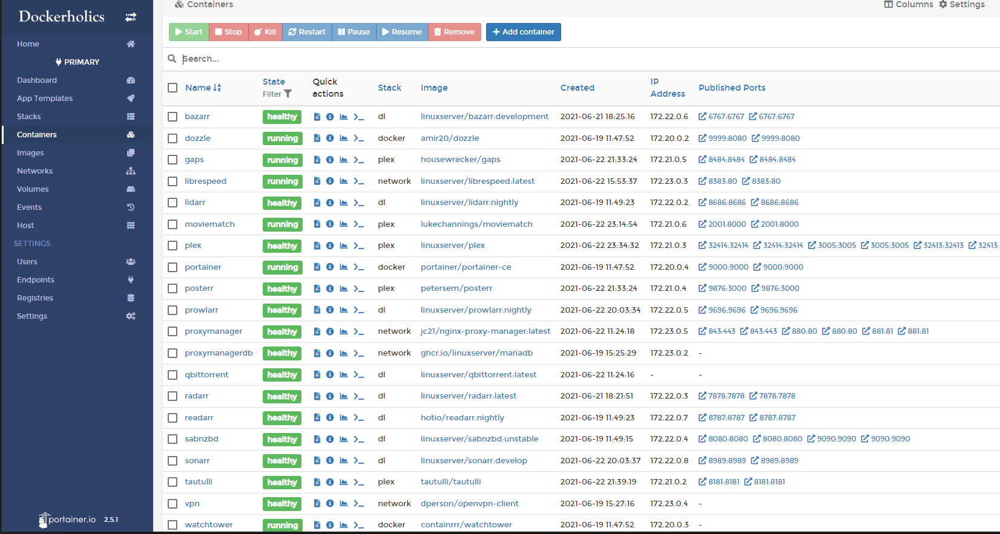

# Dockerholics Compose Examples
Here you will finds a set of a directories for commonly used docker stacks. 
- Go into the directories to read more about them.
- Review the start.txt file for the commands to run each of these stacks

